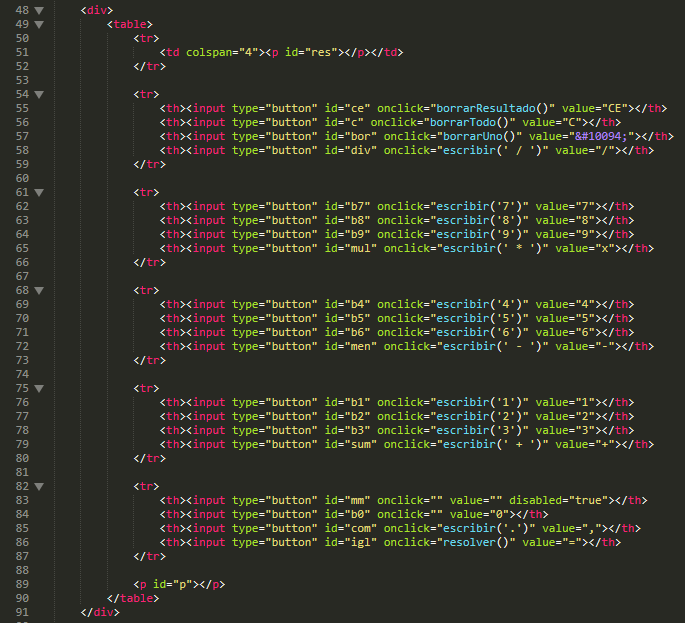
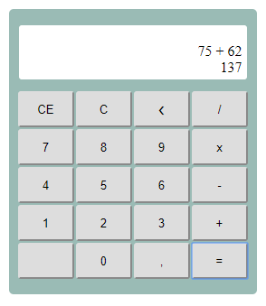
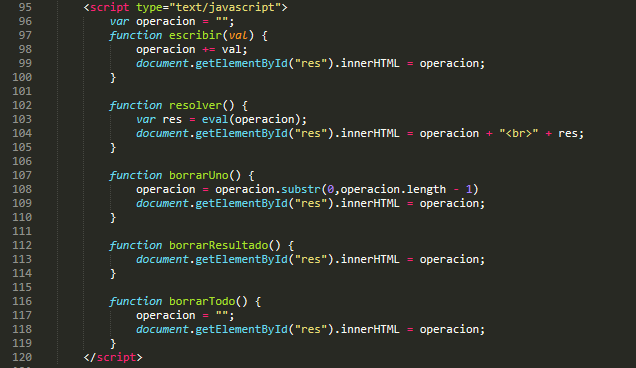
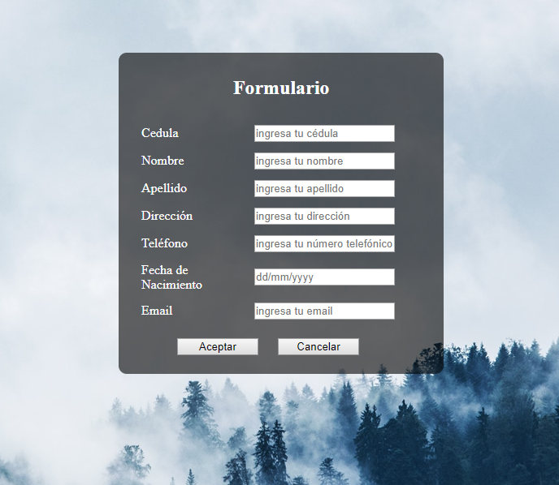
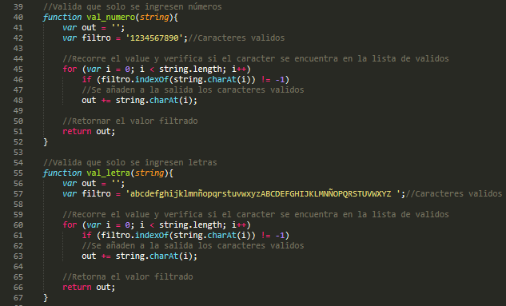
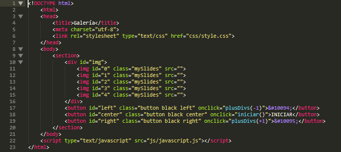
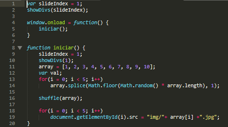

# Practica_03

### 1.	Se pide construir una calculadora en el lenguaje de programación de JavaScript con base a un formulario HTML usando botones y una caja de texto. Además, para que permita realizar operaciones aritméticas de complejidad básica, como: suma, resta, multiplicación, división, raíz cuadrada, entre otros.

Para la realización del ejercicio se desarrolló la siguiente interfaz con HTML y CSS, en donde se muestran las operaciones básicas que se piden, simulando el funcionamiento de una calculadora.

Para que la calculadora realice las operaciones indicadas, se implementó el método eval() de JavaScript para evaluar la operación ingresada y resolverla. A continuación, se muestra el código implementado para dar funcionalidad a cada uno de los botones. 

### 2.	Diseñar una interfaz en HTML que permita ingresar los siguientes campos en un formulario: cedula, nombres, apellidos, dirección, teléfono, fecha de nacimiento y correo electrónico. Luego, usando funciones de JavaScript se debe validar que todos los campos han sido ingresados, además; que los valores ingresados en cada campo del formulario sean correctos teniendo en cuenta las siguientes condiciones: 
#### a.	Se debe validar qué, en el campo de la cedula, se ingrese sólo número y que la misma sea correcta, en base, al último dígito verificador.
#### b.	Se debe validar qué, en el campo de nombres, ingrese únicamente dos nombres y que permita ingresar sólo letras. VICERRECTORADO DOCENTE Código: GUIA-PRL-001 CONSEJO ACADÉMICO Aprobación: 2016/04/06 Formato: Guía de Práctica de Laboratorio / Talleres / Centros de Simulación Resolución CS N° 076-04-2016-04-20
#### c.	Se debe validar qué, en el campo de apellidos, ingrese únicamente dos apellidos y que permita ingresar sólo letras.
#### d.	Se debe validar qué, en el campo del teléfono, permita ingresar sólo números.
#### e.	Se debe validar que la fecha de nacimiento ingrese en el formato dd/mm/yyyy.
#### f.	Se debe validar qué, en el campo correo electrónico, permita ingresar un correo válido. Se considera un correo válido, cuando comienza por tres o más valores alfanuméricos, luego un @, seguido por la extensión “ups.edu.ec” o “est.ups.edu.ec”.

Para este apartado primero se realizó la interfaz usando HTML y CSS, en donde el usuario podrá ingresar los datos requeridos. 

Mediante JavaScript se validaron que todos los campos estén ingresados correctamente.

Para la validación de sólo números o sólo letras, se implementó un método con el evento onkeyup, con el objetivo de que la validación se realice en tiempo real. 
El método consiste en aplicar un ‘filtro’, en donde se ingresan todos los caracteres que son válidos, y al momento en el que el usuario ingresa un nuevo caracter, éste se compara con el filtro y se agrega si es válido, o se borra en el caso contrario.

El resto de validaciones se realizan en cuanto el usuario da click en el botón ‘Aceptar’. 

En cuanto todas las validaciones son aceptadas bajo los parámetros requeridos, el usuario es re direccionado a una nueva página de confirmación en donde se indica que todos los datos ingresados son válidos 

### 3.	Diseñar una interfaz en html que tenga tres botones que diga “Anterior”, “Iniciar”, “Siguiente”, y una imagen. Luego, desde javascript se debe controlar para al hacer clic sobre uno de los botones realice una acción relacionada a una galería de imágenes.

Primero, usando HTML se crean las etiquetas que contendrán las imágenes que se van a presentar en la galería y los botones encargados de la navegación.

Luego, por medio de JavaScript, se eligen 5 de las 10 imágenes cargadas en la carpeta img de forma randómica. Para esto se crea un array con los índices de cada una de las 10 imágenes, y de manera aleatoria se eliminan 5 índices. Por medio del método sort() se reordena el array de manera aleatoria y finalmente se cargan las imágenes en las etiquetas HTML creadas previamente.

Por último, se le da funcionalidad a los botones encargados de la navegación para que las imágenes avancen o retrocedan, y al llegar al final o al comienzo de la galería los botones adelante o atrás, respectivamente, se deshabiliten para no permitir que el usuario avance. Esto se logra deshabilitando las etiquetas de las imágenes que no se desean mostrar, y habilitando únicamente la imagen que se muestra por medio de la navegación.

### RESULTADO(S) OBTENIDO(S):
Gracias JavaScript se han logrado implementar funciones dentro de las páginas HTML, ofreciendo una mayor variedad de opciones al usuario y mejorando su experiencia dentro de la misma, ya que mediante funciones podemos agregar animación a nuestra página. Hemos logrado, además, aumentar la seguridad de la información mediante la validación de datos, asegurándonos que el usuario llene todos los campos de manera correcta. 

### CONCLUSIONES:
JavaScript es una herramienta importante al momento de desarrollar una página web. Nos permite ofrecer una mayor cantidad de funcionalidades al usuario, además de asegurar que el usuario interactúe de forma correcta con la página. La experiencia de usuario es un campo importante dentro del desarrollo web, y JavaScript nos permite mejorarla por medio de animaciones o validaciones que, incluso, permitan personalizar nuestra página para cada usuario.

